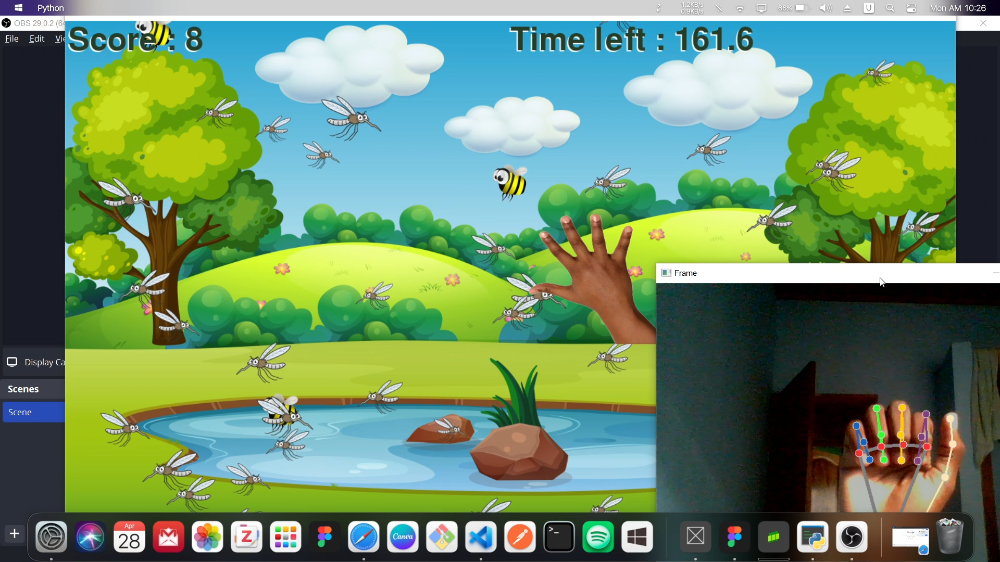

<h1 align="center">Insect Splash</h1>
<h3 align="center">Mosquito Exterminator</h3>
<br>

<p align="center">
  <a href="./Assets/InsectSplash Demo.mp4" target="_blank">
    
    <br>
    <em>Click to download/view demo video</em>
  </a>
</p>

<p align="center">
  A fun, interactive computer vision game that uses hand gestures to swat insects
</p>

<p align="center">
  
  
  
</p>

## Table of Contents

- [Table of Contents](#table-of-contents)
- [Introduction](#introduction)
- [Features](#features)
- [Requirements](#requirements)
- [Installation](#installation)
- [How to Play](#how-to-play)
- [Project Structure](#project-structure)
- [Technologies Used](#technologies-used)
- [Contributing](#contributing)
- [License](#license)

## Introduction

Insect Splash is an interactive computer vision game where players use hand gestures to swat mosquitoes while avoiding bees. The game uses your webcam and MediaPipe hand tracking to detect your hand movements, allowing you to play without touching your keyboard or mouse!

## Features

- Real-time hand tracking using MediaPipe
- Dynamic insect spawning with increasing difficulty
- Different game elements (mosquitoes to hit, bees to avoid)
- Time-based gameplay with score tracking
- Sound effects and background music

## Requirements

- Python 3.7+
- Webcam
- Sufficient lighting for hand detection

## Installation

<details>
<summary>1. Clone the repository</summary>

```bash
git clone https://github.com/GwadeSteve/Insect-Splash.git
cd Insect-Splash
```
</details>

<details>
<summary>2. Create a virtual environment</summary>

```bash
# Windows
python -m venv venv
venv\Scripts\activate

# macOS/Linux
python -m venv venv
source venv/bin/activate
```
</details>

<details>
<summary>3. Install requirements</summary>

```bash
pip install -r requirements.txt
```
</details>

## How to Play

1. **Start the game**

```bash
python main.py
```

2. **Game Controls**
   - Position your hand in front of the webcam
   - Close your hand into a fist to "swat" at insects
   - Aim for mosquitoes to gain points
   - Avoid hitting bees as they will reduce your score

3. **Objective**
   - Hit as many mosquitoes as possible within the time limit
   - Avoid hitting bees which will reduce your score
   - Try to achieve the highest score possible!

## Project Structure

```
.
├── Assets/                  # Game assets (images, sounds)
├── background.py            # Background rendering
├── bee.py                   # Bee class (enemy to avoid)
├── game.py                  # Main game logic
├── hand.py                  # Hand tracking representation
├── hand_tracking.py         # MediaPipe hand tracking implementation
├── image.py                 # Image loading utilities
├── LICENSE                  # MIT License
├── main.py                  # Entry point for the game
├── menu.py                  # Game menu
├── mosquito.py              # Mosquito class (target to hit)
├── requirements.txt         # Python dependencies
├── settings.py              # Game settings and constants
└── ui.py                    # UI elements and rendering
```

## Technologies Used

- **Pygame**: For game development and rendering
- **OpenCV**: For webcam capture and image processing
- **MediaPipe**: For hand tracking and gesture detection
- **NumPy**: For numerical operations

## Contributing

Contributions are welcome! Feel free to open issues or submit pull requests.

1. Fork the repository
2. Create your feature branch (`git checkout -b feature/amazing-feature`)
3. Commit your changes (`git commit -m 'Add some amazing feature'`)
4. Push to the branch (`git push origin feature/amazing-feature`)
5. Open a Pull Request

## License

This project is licensed under the MIT License - see the [LICENSE](LICENSE) file for details.